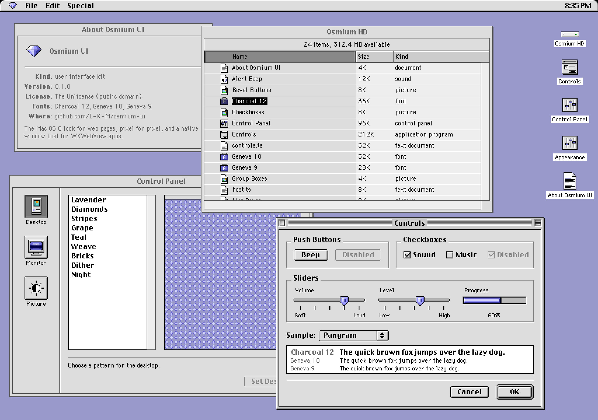
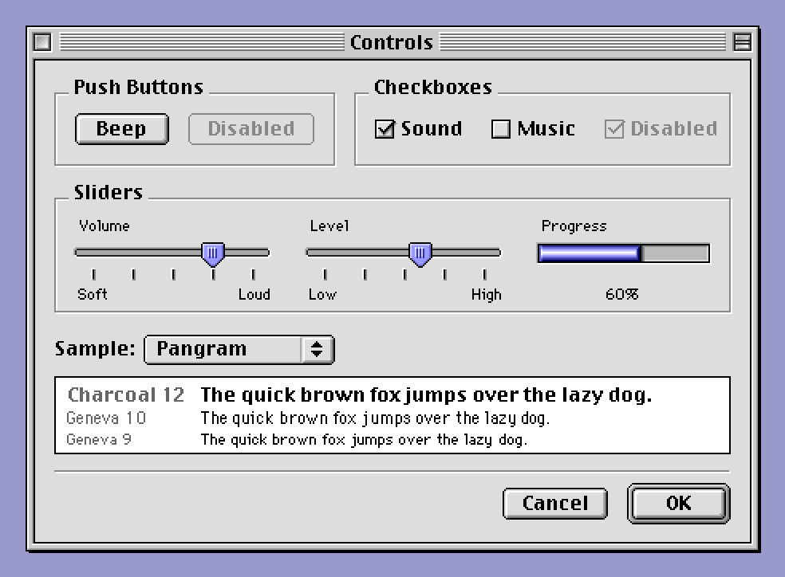
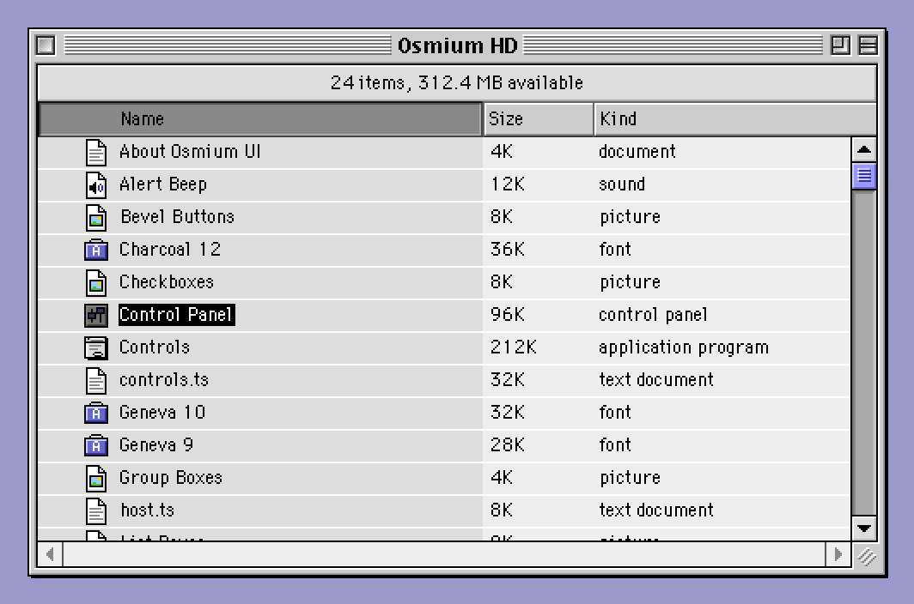
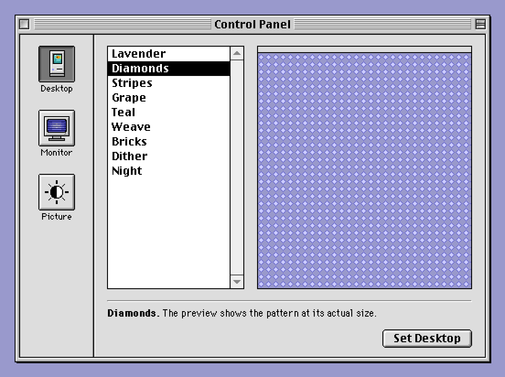
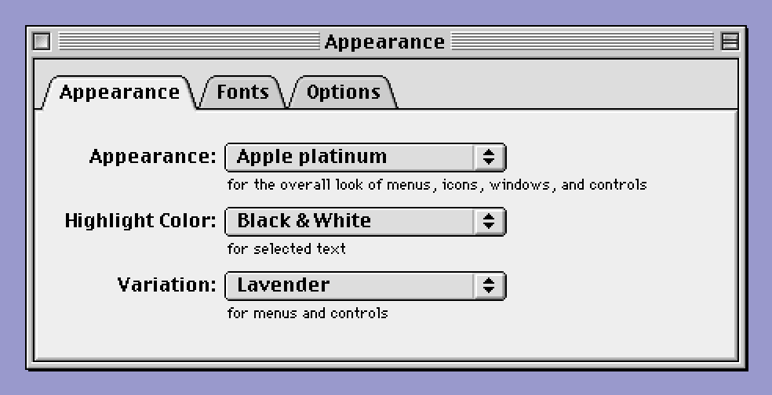

# Osmium UI

> [!IMPORTANT]
> LLM disclosure: This codebase was written with substantial help from large language models: AI coding agents working from the [`AGENTS.md`](AGENTS.md) brief in this repo.

The Mac OS 8 look, pixel for pixel, for web pages and WKWebView apps.

<p align="center">
  
</p>

Osmium UI recreates the classic Mac OS 8 appearance in HTML and CSS:
document windows with their titlebar boxes, pinstripes, grow box and
windowshade, and the controls inside them, down to the last pixel of
every bevel. It also behaves like Mac OS 8: buttons track the mouse the
way the Control Manager did, pop-up menus stick open, lists
type-select, and Return presses the default button. For macOS apps
built on WKWebView it includes a native window host, so each page can
be a real, borderless window that moves, zooms and windowshades like
the original.

## What's in the box

**Windows.** Close, zoom and collapse boxes with their pressed states,
a centered title that the pinstripes part around, the grow box, the
1px drop shadow, inactive windows, windowshade, and a Get Info style
information window (class `osm-info`, whose text dims when inactive).

**Controls.**
- Push buttons, including the default button's ring, pressed and dimmed.
- Checkboxes and sliders with tick marks.
- Pop-up buttons with their menus, and separators in them.
- The menu bar, with pull-down menus.
- Group boxes and bevel buttons.
- Tab controls, measured from Mac OS 8.5's Appearance control panel.
- Scroll bars, vertical and horizontal, and list boxes.
- Finder list-view headers and placards.
- Progress bars, separators, wells, and label/value rows.

**Fonts.** Charcoal 12, Geneva 10 and Geneva 9 as bitmap strikes. They
are compiled into TrueType fonts in the browser at startup, with
QuickDraw-style synthesized bold for Charcoal 12 and Geneva 10, so
text renders with the original glyphs on any platform.

**Behavior.**
- Press tracking: releasing outside a control cancels.
- Return and Escape flash the default and cancel buttons.
- Pop-up and pull-down menus open on a click or a press-drag-release,
  with keyboard navigation.
- Lists support arrow keys, Home/End, Page Up/Down and typing a name.
- Scroll bars have auto-repeating arrows and a draggable thumb.
- Focus rings appear only while you use the keyboard.

Native `<button>` and `<input>` elements stay underneath, so keyboard
navigation and assistive technology keep working.

<p align="center">
  
  
  
  
</p>

**Native windows (macOS).** A Swift host opens each page in a
borderless NSWindow the page draws completely. The page's boxes drive
it: zoom (decided the way the Mac OS 8 Window Manager decides it),
windowshade, the grow box and dragging. The host also persists window
frames and lets the first click on an inactive window's title bar drag
it.

### How faithful is it?

Every bitmap was measured from Mac OS 8.0 itself: a running system in
an emulator (for pressed, dimmed and inactive states) and reference
screenshots. The emulator captures were gamma-corrected back to the
Platinum palette.

During development, a harness rebuilt reference screens and compared
them pixel by pixel in normal, pressed, dimmed and inactive states. The screens were the
Open dialog, an alert, the Keyboard and Monitors & Sound control
panels, and a Finder list view.

One CSS pixel is one Mac pixel. Text and images are placed on whole
pixels the way QuickDraw placed them, and on a 2x display each Mac
pixel becomes a crisp 2x2 block.

## Try the demo

```sh
npm install
npm run demo
```

This builds the demo and serves it locally: a Mac OS 8 desktop with a
dialog full of controls, a Finder list view, a control panel, a tabbed
Appearance window (open it from its desktop icon) and an About window.
You can drag the windows, click to bring them to the front, close them
and windowshade them, and zoom and resize the Finder window.

On a Mac with the Xcode command line tools, the same pages run as
native windows:

```sh
make -C demo/macos run
```

## Install

Osmium UI ships as TypeScript source plus one stylesheet. Add it as a
git dependency, pinned to a release tag:

```sh
npm install git+https://github.com/L-K-M/osmium-ui.git#v0.1.0
```

Use a bundler that compiles TypeScript inside `node_modules`, such as
esbuild or Vite (with ts-loader, don't exclude `node_modules/osmium-ui`),
and a `moduleResolution` of `bundler` or `node16`. Copy
`node_modules/osmium-ui/osmium.css` next to your pages, or import it
through your bundler:

```ts
import "osmium-ui/osmium.css";
```

## Use it

A window is an element with content. `mountWindow` adds the chrome
around it:

```html
<link rel="stylesheet" href="osmium.css">

<div id="win" class="osm-window" style="left: 40px; top: 40px; width: 300px; height: 160px">
  <div class="osm-content osm-system" style="padding: 12px">
    <label class="osm-checkbox"><input type="checkbox" checked> Show warnings</label>
    <button id="ok" class="osm-button osm-default">OK</button>
  </div>
</div>
```

```ts
import { bindDialogKeys, mountWindow, pushButton } from "osmium-ui";

let shaded = false;
const win = mountWindow(document.getElementById("win")!, {
  title: "Settings",
  activation: "manual", // several windows share this page
  onClose: () => win.element.remove(),
  onCollapse: () => win.setShaded((shaded = !shaded)),
});
win.setActive(true);

const ok = document.getElementById("ok") as HTMLButtonElement;
pushButton(ok, () => console.log("OK"));
// Return presses OK, while this window is the active one.
bindDialogKeys(ok, null, {
  ok: () => console.log("OK"),
  active: () => !win.element.classList.contains("osm-inactive"),
});
```

`mountWindow`, `pushButton` and `centerText` call `installOsmium()` for
you. It registers the bitmap fonts and the sprites the stylesheet
draws with. Call it yourself if you use other controls without a
window.

### Controls at a glance

| Control | Markup | Behavior |
| --- | --- | --- |
| Push button | `<button class="osm-button">`, add `osm-default` for the ring | `pushButton(el, action)`, `setButtonTitle(el, text)` |
| Checkbox | `<label class="osm-checkbox"><input type="checkbox"> Title</label>` | `trackHighlight(label)` |
| Slider | `<div class="osm-slider"><input type="range" min="0" max="100"></div>` (125px wide, 100 steps) | native input |
| Pop-up button | `<button class="osm-popup">`, with an optional `<label class="osm-popup-title">` | `mountPopup(el, { items, selected, onChange })`; put `MENU_SEPARATOR` among the items for a dividing line |
| Menu bar | a `<div>` along the top of the page | `mountMenuBar(el, [{ title, items: () => [{ title, action }, MENU_SEPARATOR, …] }])`; an item without an `action` is dimmed, and `icon` names a 16x16 sprite to show instead of a title |
| List box | `<div>` with a height | `mountList(el, { rowHeight, label, onSelect })`, then `setRows(rows)`. `scrollbars: "both"` adds a horizontal bar (give the rows a `min-width`), and `header` keeps a list view's column headers scrolled with the rows |
| Scroll bar | a positioned `host` with a scrolling child `view` that leaves 15px on the right (or, for a horizontal bar, at the bottom) and hides its native scroll bars (as `mountList` sets up) | `attachScrollbar(host, view, lineHeight)`, or `attachScrollbar(host, view, step, "horizontal")` |
| Bevel button | `<button class="osm-bevel">`, a 32x32 icon in `--osm-icon`, `osm-selected` for pushed in, a `.osm-bevel-caption` below. 40x40 as in Monitors & Sound; set an even `width` for wider ones, such as Desktop Pictures' 54px | `trackPress(el, action)` |
| Group box | `<div class="osm-group"><div class="osm-group-title">Title</div>…</div>` | none |
| Tab control | `<div>` holding `<div class="osm-tablist">` of `<button class="osm-tab">` and then `<div class="osm-tab-pane">` with one panel per tab, in order. Give the `<div>` a height to have the pane fill it | `mountTabs(el, { selected, onChange })`; the arrow keys, Home and End move between tabs |
| List-view header | `<div class="osm-colheads"><button class="osm-colhead">Name</button>…</div>`, add `osm-sorted` to one header | none |
| Placard | `<div class="osm-placard">3 items</div>` | `centerText(el)` |
| Progress bar | `.osm-progress > .osm-progress-track > .osm-progress-fill`, set `--osm-value` (0 to 1) | none |
| Label/value rows | `<div class="osm-fields">` of `.osm-label` and value pairs | none |
| Separator, well | `<div class="osm-separator">`, `<div class="osm-well">` | none |

Disable a checkbox or slider with `setEnabled(input, false)` so the
whole control dims. The fonts are available as `osm-system` (Charcoal
12), `osm-small` (Geneva 10) and `osm-caption` (Geneva 9), or as the
`--osm-font-*` custom properties.

The demo's source (`demo/`) uses every control. It's the best place
to see complete markup.

### Your own icons

Sprites are pixel grids, one character per pixel. Hex digits are gray
levels (`0` is black, `f` white), other letters are palette colors
(`g` to `z`, or uppercase), and `.` is transparent. Register yours and
use them as custom properties:

```ts
import { registerSprites } from "osmium-ui";

registerSprites({
  "icon-disk": [
    "................................",
    "....000000000000000000000000....",
    // … 32 rows of 32 characters
  ],
}, { y: "#ffcc00" });
// Now available as var(--osm-sprite-icon-disk), for example as a
// bevel button's --osm-icon.
```

## Native windows on macOS

In a WKWebView app, every Osmium window can be its own borderless
NSWindow. The page fills the web view and draws the whole window,
including its 1px shadow:

```html
<html class="osm-page">
  <link rel="stylesheet" href="osmium.css">
  <body>
    <div id="win" class="osm-page-window">
      <div class="osm-content">…</div>
    </div>
    <script src="overview.js"></script>
  </body>
</html>
```

The page calls `hostWindow` instead of `mountWindow`:

```ts
import { hostWindow } from "osmium-ui";

hostWindow(document.getElementById("win")!, {
  title: "Tank Overview",
  zoom: { standard: { w: 520, h: 380 } }, // zoomed size in a browser tab
  grow: { min: { w: 360, h: 200 } },      // smallest size in a browser tab
});
```

On the Swift side, `OsmiumWindowHost` opens the pages and applies what
their boxes ask for. Keep the host for as long as its windows are open;
the windows only reference it weakly:

```swift
import OsmiumUI // with Swift Package Manager

final class AppDelegate: NSObject, NSApplicationDelegate {
    let host = OsmiumWindowHost(frames: OsmiumFrameStore(prefix: "MyAppFrame."))

    func applicationDidFinishLaunching(_ notification: Notification) {
        let overview = host.add(OsmiumWindowSpec(
            url: Bundle.main.url(forResource: "overview", withExtension: "html",
                                 subdirectory: "web")!,
            title: "Tank Overview", frameKey: "Overview",
            size: NSSize(width: 521, height: 381),
            minSize: NSSize(width: 361, height: 201)))
        host.show(overview)
    }
}
```

In a native window the Swift spec decides the geometry: `size` is the
first and the zoomed (standard) size, both counting the 1px shadow, and
`minSize` makes the window growable and zoomable. Give zoom and grow
boxes only to pages whose spec has a `minSize`.

Pages loaded from file URLs can't run module scripts, so bundle their
scripts as classic scripts (for example with esbuild's
`--format=iife`), or serve the pages through a URL scheme handler set
up in the host's `configuration` closure.

Add the host with Swift Package Manager:

```swift
.package(url: "https://github.com/L-K-M/osmium-ui.git", from: "0.1.0")
```

and depend on the `OsmiumUI` product, or compile
`macos/OsmiumWindows.swift` into your app directly. It needs macOS 12
or later.

The page talks to the host through the `osmium` script message
handler, which the host registers on each window's web view. It sends
these ops:

| Op | Effect |
| --- | --- |
| `winClose` | Close the window. |
| `winZoom` | Toggle between the user size and the standard size. |
| `winShade` `{on}` | Fold the window to its titlebar and back. |
| `winGrow` | Track the grow box. |
| `dragWindow` | Move the window with the mouse. |

If your app already relays page messages, pass
`messageHandlerName: nil` and call `host.handle(body, from: webView)`.
Give `hostWindow` your own `post` function to match; the page then
counts as native.

Escape closes a hosted window unless the page handles the key itself
or the focus is in a text field. Pass `escape: "ignore"` for a window
that shouldn't close.

In a plain browser tab, the same page fills the tab and does what a tab
can.

## Browser support

Osmium UI runs in current Chromium, Safari and Firefox, and in
WKWebView on macOS 12 and later. It relies on the FontFace API,
ResizeObserver and CSS `border-image`.

## Not included yet

Radio buttons, editable text fields, tabs, alert windows, and keyboard
equivalents shown in menus.

## Development

```sh
npm install
npm run typecheck
npm test
npm run demo:build
```

## Origin

Osmium UI started as the window kit of
[Finsical](https://github.com/L-K-M/Finsical), a retro virtual
aquarium for macOS.

## License

Public domain, under the [Unlicense](LICENSE).

The bitmap fonts and control bitmaps are recreations of Mac OS 8.0
screen output. Mac OS, Charcoal, Geneva and Platinum are trademarks of
Apple Inc. Osmium UI is not affiliated with or endorsed by Apple.
