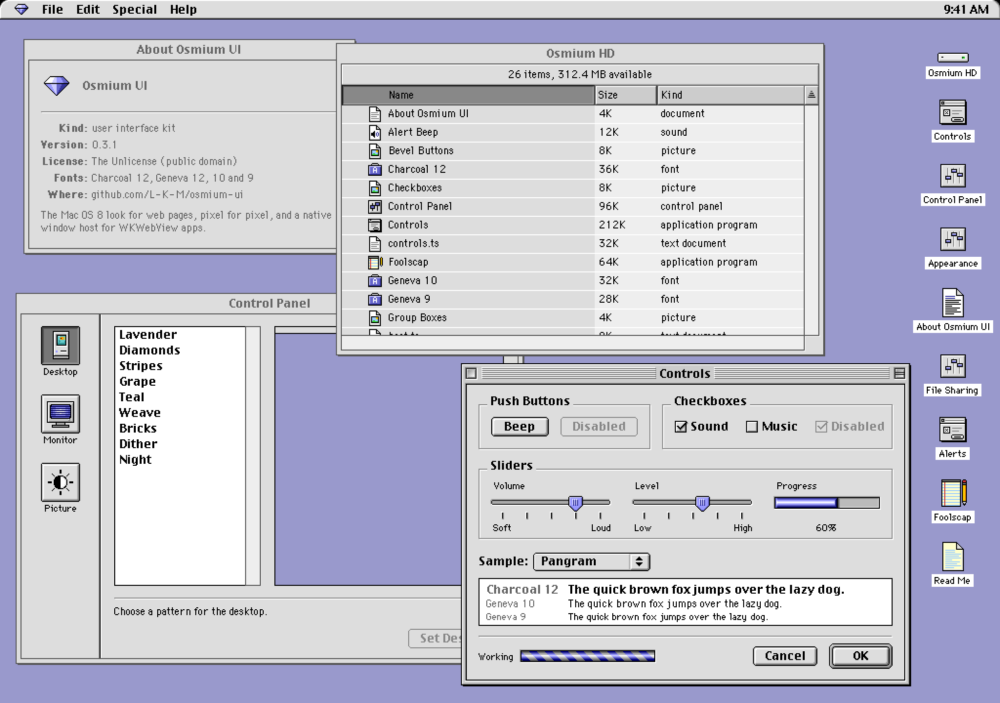
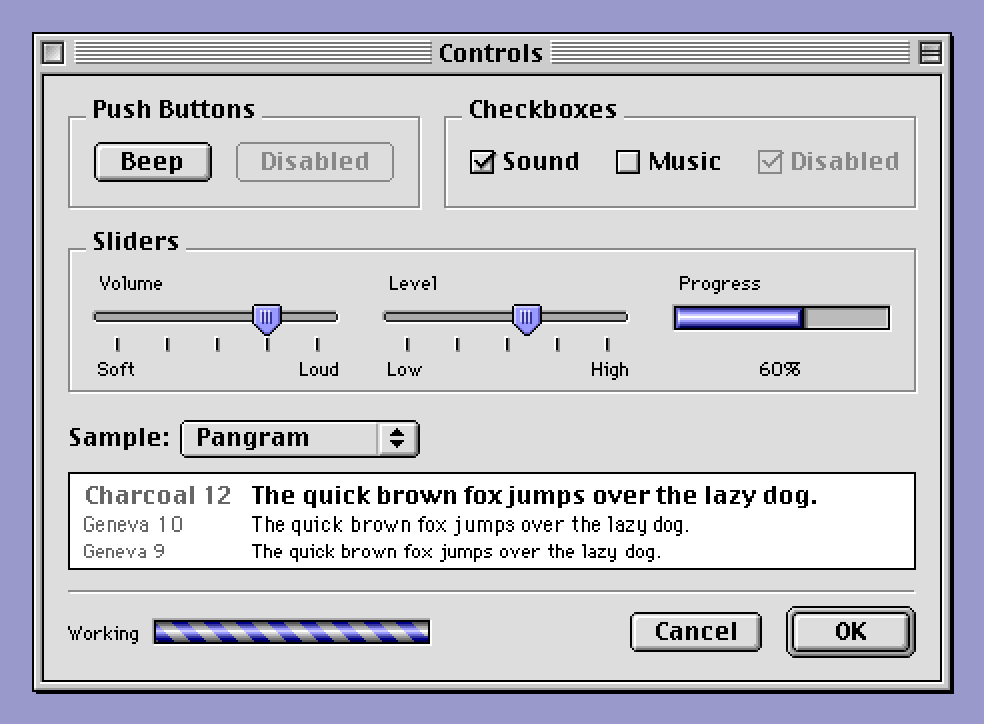
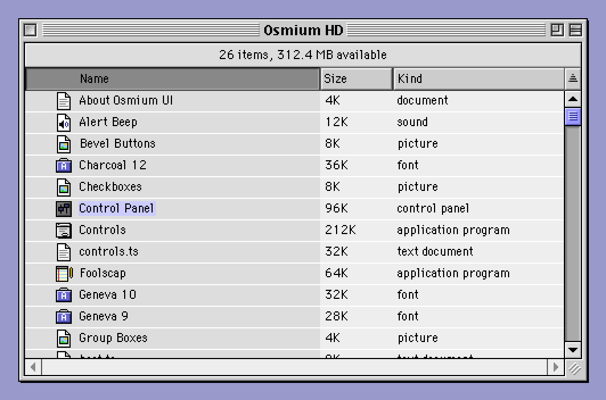
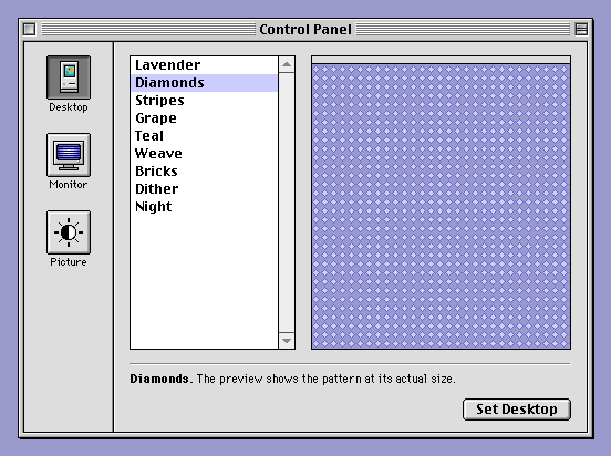
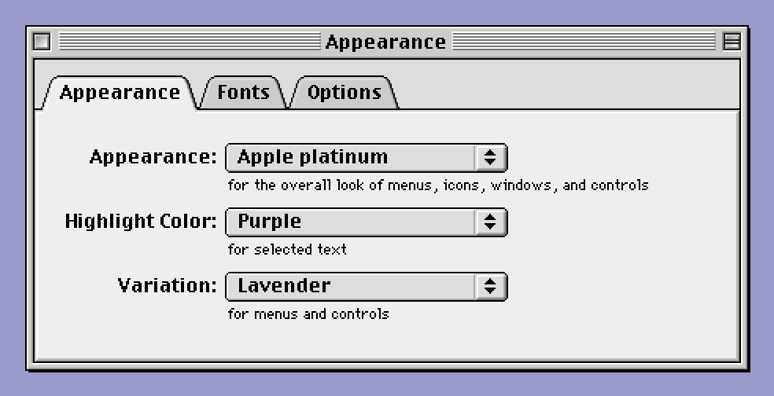

# Osmium UI

> [!IMPORTANT]
> LLM disclosure: This codebase was written with substantial help from large language models: AI coding agents working from the [`AGENTS.md`](AGENTS.md) brief in this repo.

The Mac OS 8 look, pixel for pixel, for web pages and WKWebView apps.

<p align="center">
  
</p>

Osmium UI recreates the classic Mac OS 8 appearance in HTML and CSS:
document windows with their titlebar boxes, pinstripes, grow box and
windowshade, and the controls inside them, down to the last pixel of
every bevel. It also behaves like Mac OS 8: buttons track the mouse the
way the Control Manager did, pop-up menus stick open, lists
type-select, and Return presses the default button. For macOS apps
built on WKWebView it includes a native window host, so each page can
be a real, borderless window that moves, zooms and windowshades like
the original.

## What's in the box

**Windows.** Close, zoom and collapse boxes with their pressed states,
a centered title that the pinstripes part around, the grow box, the
1px drop shadow, inactive windows, windowshade, and a Get Info style
information window (class `osm-info`, whose text dims when inactive).

**Controls.**
- Push buttons, including the default button's ring, pressed and dimmed.
- Checkboxes and sliders with tick marks.
- Pop-up buttons with their menus, and separators in them.
- The menu bar, with pull-down menus.
- Group boxes and bevel buttons.
- Tab controls, measured from Mac OS 8.5's Appearance control panel.
- Scroll bars, vertical and horizontal, and list boxes.
- Finder list-view headers and placards.
- List views over any data: sortable columns, the Finder's sort order
  button, resizable columns, icons and controls in rows, and thousands
  of rows kept up to date by key.
- Progress bars, separators, wells, and label/value rows.
- Edit text fields, one-line and multi-line.
- Balloon Help: help balloons measured from Mac OS 8.0, with the Help
  menu's Show Balloons / Hide Balloons command.
- Alert boxes: stop, caution and note alerts, modal or movable. The
  modal frame, the stop and caution icons and the layout are measured
  from Mac OS 8.0's Finder; the movable title bar and the note icon
  come from the Mac OS 8 HIG's figures.

**Fonts.** Charcoal 12, Geneva 10 and Geneva 9 as bitmap strikes. They
are compiled into TrueType fonts in the browser at startup, with
QuickDraw-style synthesized bold for Charcoal 12 and Geneva 10, so
text renders with the original glyphs on any platform.

**Behavior.**
- Press tracking: releasing outside a control cancels.
- Return and Escape flash the default and cancel buttons.
- Pop-up and pull-down menus open on a click or a press-drag-release,
  with keyboard navigation.
- Lists support arrow keys, Home/End, Page Up/Down and typing a name.
- Scroll bars have auto-repeating arrows and a draggable thumb.
- Focus rings appear only while you use the keyboard, except on edit
  text: a field shows its ring however it got the focus, because the
  ring marks where typing goes.

Native `<button>` and `<input>` elements stay underneath, so keyboard
navigation and assistive technology keep working.

<p align="center">
  
  
  
  
</p>

**Native windows (macOS).** A Swift host opens each page in a
borderless NSWindow the page draws completely. The page's boxes drive
it: zoom (decided the way the Mac OS 8 Window Manager decides it),
windowshade, the grow box and dragging. The host also persists window
frames and lets the first click on an inactive window's title bar drag
it.

### How faithful is it?

Every bitmap was measured from Mac OS 8.0 itself: a running system in
an emulator (for pressed, dimmed and inactive states) and reference
screenshots. The emulator captures were gamma-corrected back to the
Platinum palette.

During development, a harness rebuilt reference screens and compared
them pixel by pixel in normal, pressed, dimmed and inactive states. The screens were the
Open dialog, an alert, the Keyboard and Monitors & Sound control
panels, and a Finder list view.

One CSS pixel is one Mac pixel. Text and images are placed on whole
pixels the way QuickDraw placed them, and on a 2x display each Mac
pixel becomes a crisp 2x2 block.

## Try the demo

```sh
npm install
npm run demo
```

This builds the demo and serves it locally: a Mac OS 8 desktop with a
dialog full of controls, a Finder list view, a control panel, a tabbed
Appearance window and a File Sharing window full of edit text (open
them from their desktop icons), and an About window.
You can drag the windows, click to bring them to the front, close them
and windowshade them, and zoom and resize the Finder window.
Choose Show Balloons from the Help menu, then rest the pointer on a
control, a window's title bar or a desktop icon to see its help balloon.
The Alerts window (open it from its desktop icon) and Special > Empty
Trash… bring up alerts.

On a Mac with the Xcode command line tools, the same pages run as
native windows:

```sh
make -C demo/macos run
```

## Install

Osmium UI ships as TypeScript source plus one stylesheet. Add it as a
git dependency, pinned to a release tag:

```sh
npm install git+https://github.com/L-K-M/osmium-ui.git#v0.1.0
```

Use a bundler that compiles TypeScript inside `node_modules`, such as
esbuild or Vite (with ts-loader, don't exclude `node_modules/osmium-ui`),
and a `moduleResolution` of `bundler` or `node16`. Copy
`node_modules/osmium-ui/osmium.css` next to your pages, or import it
through your bundler:

```ts
import "osmium-ui/osmium.css";
```

## Use it

A window is an element with content. `mountWindow` adds the chrome
around it:

```html
<link rel="stylesheet" href="osmium.css">

<div id="win" class="osm-window" style="left: 40px; top: 40px; width: 300px; height: 160px">
  <div class="osm-content osm-system" style="padding: 12px">
    <label class="osm-checkbox"><input type="checkbox" checked> Show warnings</label>
    <button id="ok" class="osm-button osm-default">OK</button>
  </div>
</div>
```

```ts
import { bindDialogKeys, mountWindow, pushButton } from "osmium-ui";

let shaded = false;
const win = mountWindow(document.getElementById("win")!, {
  title: "Settings",
  activation: "manual", // several windows share this page
  onClose: () => win.element.remove(),
  onCollapse: () => win.setShaded((shaded = !shaded)),
});
win.setActive(true);

const ok = document.getElementById("ok") as HTMLButtonElement;
pushButton(ok, () => console.log("OK"));
// Return presses OK, while this window is the active one.
bindDialogKeys(ok, null, {
  ok: () => console.log("OK"),
  active: () => !win.element.classList.contains("osm-inactive"),
});
```

`mountWindow`, `pushButton` and `centerText` call `installOsmium()` for
you. It registers the bitmap fonts and the sprites the stylesheet
draws with. Call it yourself if you use other controls without a
window.

### Controls at a glance

| Control | Markup | Behavior |
| --- | --- | --- |
| Push button | `<button class="osm-button">`, add `osm-default` for the ring | `pushButton(el, action)`, `setButtonTitle(el, text)` |
| Checkbox | `<label class="osm-checkbox"><input type="checkbox"> Title</label>` | `trackHighlight(label)` |
| Slider | `<div class="osm-slider"><input type="range" min="0" max="100"></div>` (125px wide, 100 steps) | native input |
| Pop-up button | `<button class="osm-popup">`, with an optional `<label class="osm-popup-title">` | `mountPopup(el, { items, selected, onChange })`; put `MENU_SEPARATOR` among the items for a dividing line |
| Menu bar | a `<div>` along the top of the page | `mountMenuBar(el, [{ title, items: () => [{ title, action }, MENU_SEPARATOR, …] }])`; an item without an `action` is dimmed, and `icon` names a 16x16 sprite to show instead of a title |
| List box | `<div>` with a height | `mountList(el, { rowHeight, label, onSelect })`, then `setRows(rows)`. `scrollbars: "both"` adds a horizontal bar (give the rows a `min-width`), and `header` keeps a list view's column headers scrolled with the rows |
| Scroll bar | a positioned `host` with a scrolling child `view` that leaves 15px on the right (or, for a horizontal bar, at the bottom) and hides its native scroll bars (as `mountList` sets up) | `attachScrollbar(host, view, lineHeight)`, or `attachScrollbar(host, view, step, "horizontal")` |
| Bevel button | `<button class="osm-bevel">`, a 32x32 icon in `--osm-icon`, `osm-selected` for pushed in, a `.osm-bevel-caption` below. 40x40 as in Monitors & Sound; set an even `width` for wider ones, such as Desktop Pictures' 54px | `trackPress(el, action)` |
| Group box | `<div class="osm-group"><div class="osm-group-title">Title</div>…</div>` | none |
| Tab control | `<div>` holding `<div class="osm-tablist">` of `<button class="osm-tab">` and then `<div class="osm-tab-pane">` with one panel per tab, in order. Give the `<div>` a height to have the pane fill it | `mountTabs(el, { selected, onChange })`; the arrow keys, Home and End move between tabs |
| List-view header | `<div class="osm-colheads"><button class="osm-colhead">Name</button>…</div>`, add `osm-sorted` to one header | none |
| List view | `<div>` with a size | `mountListView(el, { label, columns, key, cell })`, then `setRows(rows)`; see [List view](#list-view) |
| Placard | `<div class="osm-placard">3 items</div>` | `centerText(el)` |
| Progress bar | `.osm-progress > .osm-progress-track > .osm-progress-fill`, set `--osm-value` (0 to 1) | none |
| Label/value rows | `<div class="osm-fields">` of `.osm-label` and value pairs | none |
| Separator, well | `<div class="osm-separator">`, `<div class="osm-well">` | none |
| Edit text | `<input class="osm-edit">` (22px), add `osm-compact` for 20px; `<div class="osm-edit-area"><textarea></textarea></div>` for several lines | native input; `mountTextArea(el)` adds a scroll bar to a multi-line field; `setEnabled(field, on)` |
| Help balloon | none: attach it to any element | `attachBalloon(el, { content })`, and `balloonMenuItem()` in a Help menu; see [Balloon Help](#balloon-help) |
| Alert | built for you | `showAlert({ kind, message, explanation, buttons })`, see [Alerts](#alerts) |

Disable a checkbox, slider or edit text with `setEnabled(input, false)`
so the whole control dims. The fonts are available as `osm-system` (Charcoal
12), `osm-small` (Geneva 10) and `osm-caption` (Geneva 9), or as the
`--osm-font-*` custom properties.

The demo's source (`demo/`) uses every control. It's the best place
to see complete markup.

### Edit text

A one-line field is a native input that `osmium.css` draws completely,
for any text type, including `password`:

```html
<label for="name">Name:</label>
<input id="name" class="osm-edit" value="Macintosh HD" style="width: 160px">
<input class="osm-edit osm-compact" aria-label="Find" style="width: 120px">
```

The field's box is its black line, the way the Mac OS 8 guidelines
measure a field: 22px tall, or 20px with `osm-compact` for a field in a
row of 20px buttons and pop-ups. The 1px bevel and the 2px focus ring
are drawn outside that box, so keep 2px between a field and the edge
of anything that clips, such as a window's content. The guidelines
space things like this: 5px from a label to its field, 6px between
stacked fields, 4px between a field and its pop-up. Place a label 3px
below the field's top (2px beside a compact field) so their baselines
meet.

Mac OS 8 had no placeholder text and no search field. Placeholders
work, in a gray chosen for contrast, and `type="search"` looks like any
other field, without the magnifier or the clear button.

For several lines, put a `<textarea>` in an `osm-edit-area`. On its own
it is the Dialog Manager's multi-line edit text: the text wraps and is
clipped, and it scrolls with the caret but has no scroll bar.
`mountTextArea` adds an Osmium scroll bar that follows typing; call its
`update()` after setting the text from a script. Disable a text area
with `setEnabled`: the `disabled` attribute alone dims only its text,
not its frame or scroll bar. Give the area a height of 16px per line
plus 6px, so 54px for three lines:

```html
<div id="notes" class="osm-edit-area" style="width: 200px; height: 54px">
  <textarea aria-label="Notes"></textarea>
</div>
```

```ts
import { mountTextArea } from "osmium-ui";

const notes = mountTextArea(document.getElementById("notes")!);
notes.textarea.value = "Three lines,\nor more.";
notes.update();
```

In a dialog bound with `bindDialogKeys`, Return and Escape typed in a
one-line field press the default and cancel buttons, as the Mac OS 8
Dialog Manager does, unless your own keydown handler on the field calls
`preventDefault()` (to save on Return, say). Text areas and other text
fields keep their keys.

An inactive window's fields hide their ring, caret and selection. With
`activation: "manual"`, also blur a focused field when its window
deactivates, or typing still goes into it. The demo desktop does this.

The frame, the text placement, the caret's height and the inactive look
match Mac OS 8.0 Find File as captured in an emulator, and the ring
matches Mac OS 9.0 Date Formats. Some details differ:

- A disabled field wasn't captured. It is drawn like a field in an
  inactive window, which was.
- No dimmed scrolling text area was captured. In an inactive window or
  disabled, its scroll bar is blank like an inactive window's, but
  edged in the frame's gray (888888) rather than 555555, so the frame
  stays one gray line where the bar overlaps it.
- Mac OS 8.0 dims a window's static text in an inactive window, labels
  beside fields included. Osmium's plain labels stay black; dim them
  yourself if you want that.
- The top-right and bottom-left bevel pixels are left open. Mac OS 8.0
  Find File draws them gray, while other sources leave them open.
- The browser draws the caret one pixel right of where TextEdit does,
  and the selection covers only the selected characters. TextEdit
  extends it to the field's right edge when it reaches the end of the
  text.
- Selected text is white on 010101 rather than black: WebKit lightens
  an opaque black selection to 333333.

### Balloon Help

Give any element a help balloon, and put the Show Balloons command in
a Help menu:

```ts
import {
  MENU_SEPARATOR, attachBalloon, balloonMenuItem, mountMenuBar,
} from "osmium-ui";

mountMenuBar(bar, [
  // … your other menus
  { title: "Help", items: () => [
    { title: "About MyApp…", action: about }, MENU_SEPARATOR,
    balloonMenuItem(), // "Show Balloons" or "Hide Balloons"
  ] },
]);
attachBalloon(okButton, {
  content: "OK button\n\nTo save your changes, click here.",
});
// A message that follows the control's state:
attachBalloon(wake, {
  content: () => wake.disabled ? "Wake\n\nNot available during a scan."
                               : "Wake\n\nSends a wake-up packet.",
});
```

A `content` function runs again whenever the target's attributes change
(`disabled` above), it fires `input` or `change` (a checkbox's checked
state), or it gets focus, so the message stays current whether or not
the balloon is open. State kept anywhere else needs
`balloon.setContent(fn)` to refresh it.

As in Mac OS 8, balloons open only while Balloon Help is on
(`setBalloonHelp("shown")`, or the menu command), once the pointer has
rested on the target for a tenth of a second, and close the moment it
leaves. One balloon is open at a time. An app without a Help menu can
pass `trigger: "hover"`: that balloon also opens while Balloon Help is
off, after `delay` ms (500 by default). Mac OS had no such mode.

The balloon picks its own width with the Help Manager's golden-ratio
search and wraps plain text the way Mac OS 8.0 did (`"\n"` starts a new
line; `"\n\n"` leaves a blank line). It prefers the `variant` you give
(`"left-top"` by default, tail on the left near the top) and flips to
another side near the screen's edges and away from a menu bar. The tip
points 10px in from the target's right and bottom edges, the Help
Manager's default for dialog items; `tip: "pointer"` points it where the
pointer rests instead. `content` can also be a DOM node, for bold text
(`<strong>`) or a list; it is copied each time the balloon opens.

The balloon is the target's `aria-describedby` description, so screen
readers read it whether or not Balloon Help is on. Attach it to the
focusable control itself (a checkbox's `<input>`, not the `<label>`
around it), because a description on a wrapper reaches no screen
reader; pointing at the control's `<label>` opens the balloon too. It
also opens when a control gets keyboard focus while the keyboard is
driving, and Escape closes it without cancelling the dialog around it.
Call `detach()` when you remove the target: until then its balloon
element stays in the page. Drop the target's `title` attribute, or the
browser shows its own tooltip too.

What differs from Mac OS 8, on purpose or for want of a measurement:

- Keyboard focus and Escape are additions. Touch has no long-press;
  touch readers get the description instead.
- Balloons ignore the pointer and close when it leaves the target, as
  in Mac OS, so they are not "hoverable" as WCAG 1.4.13 asks.
- Balloons close when the page, or anything scrolling around the
  target, scrolls, and when the window resizes or loses focus.
- The size search reproduces all 11 fully read Mac OS 8.0 balloons, but
  not Hide Balloons' own "Turns Balloon help off." balloon (58 wide,
  where the search gives 38). Other widths are the model's.
- The order in which variants are tried was not measured, only that
  balloons flip. `tip: "pointer"` rests on the Finder's title-bar
  balloons alone.
- Rich content is styled by approximation: bold Geneva 9 is
  synthesized (it was never captured), lists and paragraph spacing are
  a guess, and code, italics and links draw as plain Geneva 9. Its
  lines break where the browser breaks them.

The balloon's shape, its eight tails and the text layout were compared
pixel for pixel with 13 Mac OS 8.0 balloons captured in an emulator,
covering all eight tails: 0 differing pixels, text included.

### Alerts

`showAlert` puts up a Mac OS 8 alert box, laid out with the metrics of
Mac OS 8.0's Finder alerts, and blocks the rest of the page until one
of its buttons is pressed:

```ts
import { showAlert } from "osmium-ui";

const alert = showAlert({
  kind: "caution", // "stop", "note", or "plain" (with your own icon)
  message: "Do you want to save the changes you made to “Report”?",
  explanation: "If you don’t save them, they will be lost.",
  buttons: { ok: "Save", cancel: "Cancel", other: "Don’t Save" },
  parent: win, // drawn inactive while the alert is up
});
if ((await alert.result) === "ok") save();
```

Return and Enter press the default button (`defaultButton`, OK unless
you say otherwise), and Escape and Command-period the cancel button
(`cancelButton`, Cancel when there is one). Pass `modality: "movable"`
for an alert with a title bar to drag it by, and `position: "parent"`
to center it on `parent` rather than on the page. Presses outside the
alert call `onBeep`, where Mac OS plays the alert sound; Osmium plays
none itself. `close()` takes the alert down from code.

The alert takes the keyboard focus itself, so no button shows a focus
ring until you press Tab; Tab and Shift-Tab then stay among its
buttons. While it is up the rest of the page is `inert`, menu bar
titles dim, `bindDialogKeys` handlers stand down, and a window with
`"page"` activation draws inactive.

Some of the alert is derived rather than measured (the explanation's
spacing, the third button's place, how buttons and the alert grow);
the CHANGELOG lists which parts.

### List view

`mountListView` builds a Finder list view from your data: column
headers that pick the sort column, the sort order button above the
scroll bar, both scroll bars, and rows with small icons. Rows are
matched by key, so you can call `setRows` as often as your data changes
(a network scan, say) and the selection, each row's elements and the
reader's place survive.

```ts
import { mountListView } from "osmium-ui";

const list = mountListView<Host>(document.getElementById("hosts")!, {
  label: "Hosts",
  columns: [
    { id: "fav", title: "Fav.", width: 30 },
    { id: "ip", title: "IP", width: 120, sort: "ascending" },
    { id: "ports", title: "Ports", width: 60, sort: "descending",
      align: "right" },
  ],
  primary: "ip", // gets the icon and the Finder's "label" highlight
  key: (h) => h.ip,
  cell(h, column, width, current) {
    if (column.id === "ip") return h.ip;
    if (column.id === "ports") return String(h.ports.length);
    // Update the node you returned before, so the control keeps it.
    const star = (current as HTMLButtonElement | null) ?? makeStar(h.ip);
    star.setAttribute("aria-pressed", String(favorites.has(h.ip)));
    return star;
  },
  icon: (h) => ({ image: "var(--osm-sprite-icon-printer)", label: "Printer" }),
  rowClass: (h) => (h.stale ? ["stale"] : []),
  sort: { column: "ip", order: "normal" },
  onSort: (s) => list.setRows(sortHosts(hosts, s), { scroll: "top" }),
  onSelect: (ip) => showDetails(ip),
  onContextMenu: (ip, event) => openMenu(ip, event.clientX, event.clientY),
  emptyText: "No hosts yet. Start a scan.",
  loadingText: "Scanning...",
});
list.setRows(sortHosts(hosts, list.sort!));
```

**Sorting.** As in the Finder, the list has one sort column and one
order for the whole list: `"normal"`, the column's own order (names A
to Z, sizes largest first), or `"reversed"`. A click on a header picks
that column and keeps the order; the sort order button (Finder 8.1)
flips the order. Clicking the sorted header again does nothing. The
list shows the sort and reports it to `onSort`; you sort the rows by
the column's normal order, turn the whole list over when it is
reversed, and pass them to `setRows`. A column's `sort` names its
normal direction, which screen readers hear as `aria-sort`.

**Updates.** `setRows` takes the rows in display order. A row whose
object is the same (`===`) as before keeps its cells untouched, so treat
rows as immutable values and call `refresh()` when something else that
`cell` or `rowClass` reads has changed. The selection stays with its key,
even while the row is filtered out. While the list is scrolled, the row
at the top of the view stays put as rows arrive above it; at the very
top, arrivals show. `{ scroll: "top" }` goes back to the top and then to
the selection, for a new order. `cell` gets the cell's width, so you can
shorten a date as its column narrows, as the Finder does.

**Controls in rows.** A press on a button, input, label, link or an
element marked `data-osm-control` inside a cell belongs to that
control: the selection doesn't move, the list doesn't capture the
pointer, and double-clicks don't open the row. While a press in the rows
lasts, and until its click is over, the list holds updates back, so no
control is replaced or moved under the pointer. Give such controls
`tabIndex = -1` so the list stays one tab stop; Space then clicks the
selected row's first control, so they stay usable from the keyboard.

**Keyboard.** The arrow keys, Home, End, Page Up and Page Down move the
selection, Return calls `onOpen`, and typing selects the first row whose
primary text (or `typeSelect(row)`) starts with what you typed within
the last second, spaces included. A space while you type is part of the
name; Space on its own goes to the row's control. A contextual menu
request from the keyboard (the menu key or Shift-F10, where the system
sends one) is for the selected row.

**Resize to fit.** `contentHeight` is the height the rows need (or the
placeholder's, while there are none) and `viewportHeight` the height
they have now; a zoom box or "resize to fit" adds the difference.

**Long lists.** Up to 1000 rows, every row is in the DOM, laid out
lazily with `content-visibility`. Above that (`rendering: "auto"`, the
default) only the rows in and near the view, the selected row and rows
under a press have elements: 4096 rows then take 2 to 5 ms per update
and about 30 ms to reorder in Chromium, WebKit and Firefox, where every
row in the DOM costs WebKit 24 ms per update and 0.7 s to reorder.
Browser find-in-page doesn't see rows without elements; pass
`rendering: "all"` to keep them all. `cell` must be cheap either way.

**Assistive technology.** The rows form a `grid` with the headers as
its first row. The selected row is the grid's active descendant, row
icons carry their `label`, and the placeholder is a status message.
Sortable headers and the sort order button are buttons of their own, so
the list takes one tab stop for the rows plus one per sortable column
and one for the button.

Options: `highlight: "label"` highlights only the primary column's name
and darkens its icon, as the Finder does, instead of the whole row;
`resize: "drag"` lets the reader drag the dividers between header cells
(Finder 8.5) and reports widths to `onColumnResize`; a column's `grow`
shares out width beyond the columns' total; `sortOrderButton: "none"`
leaves the button out, as in Finder 8.0. The selection uses
`--osm-highlight` and `--osm-highlight-text`.

What differs from Mac OS 8:

- No Mac OS 8.x list view capture was found, so the sort order button
  and the unsorted header's right end were measured from Mac OS 9.0
  (Finder and Sherlock 2), and the header end also from Mac OS 7.6's
  Extensions Manager. The reversed button was never captured: its
  pyramid is drawn upside down from the captured one's steps and
  shading. Pressed headers and a pressed sort order button weren't
  captured either, so they don't look pressed.
- The divider's hit zone (7px), its cursor (the browser's `col-resize`)
  and the 24px narrowest column are guesses. Mac OS 8.5's theme cursor
  wasn't captured.
- One row is selected at a time. A mouse drag moves the selection, as
  in a List Manager list; the Finder's drag selects a group of items,
  which isn't reproduced.
- Home, End and the Page keys move the selection, like `mountList`;
  the Finder only scrolled. Type-select matches the start of a name
  rather than the List Manager's nearest match, and Tab doesn't move
  through the items alphabetically as it does in the Finder.
- `grow`, the placeholder text, icon headers and controls in rows are
  additions; so is a contextual menu request from the keyboard.
- Text insets follow the kit's earlier Finder window (text 4px in, the
  icon at 26px, the name at 48px); Mac OS 9.0 measures 6 or 7, 22 and
  42.

### Your own icons

Sprites are pixel grids, one character per pixel. Hex digits are gray
levels (`0` is black, `f` white), other letters are palette colors
(`g` to `z`, or uppercase), and `.` is transparent. Register yours and
use them as custom properties:

```ts
import { registerSprites } from "osmium-ui";

registerSprites({
  "icon-disk": [
    "................................",
    "....000000000000000000000000....",
    // … 32 rows of 32 characters
  ],
}, { y: "#ffcc00" });
// Now available as var(--osm-sprite-icon-disk), for example as a
// bevel button's --osm-icon.
```

## Native windows on macOS

In a WKWebView app, every Osmium window can be its own borderless
NSWindow. The page fills the web view and draws the whole window,
including its 1px shadow:

```html
<html class="osm-page">
  <link rel="stylesheet" href="osmium.css">
  <body>
    <div id="win" class="osm-page-window">
      <div class="osm-content">…</div>
    </div>
    <script src="overview.js"></script>
  </body>
</html>
```

The page calls `hostWindow` instead of `mountWindow`:

```ts
import { hostWindow } from "osmium-ui";

hostWindow(document.getElementById("win")!, {
  title: "Tank Overview",
  zoom: { standard: { w: 520, h: 380 } }, // zoomed size in a browser tab
  grow: { min: { w: 360, h: 200 } },      // smallest size in a browser tab
});
```

On the Swift side, `OsmiumWindowHost` opens the pages and applies what
their boxes ask for. Keep the host for as long as its windows are open;
the windows only reference it weakly:

```swift
import OsmiumUI // with Swift Package Manager

final class AppDelegate: NSObject, NSApplicationDelegate {
    let host = OsmiumWindowHost(frames: OsmiumFrameStore(prefix: "MyAppFrame."))

    func applicationDidFinishLaunching(_ notification: Notification) {
        let overview = host.add(OsmiumWindowSpec(
            url: Bundle.main.url(forResource: "overview", withExtension: "html",
                                 subdirectory: "web")!,
            title: "Tank Overview", frameKey: "Overview",
            size: NSSize(width: 521, height: 381),
            minSize: NSSize(width: 361, height: 201)))
        host.show(overview)
    }
}
```

In a native window the Swift spec decides the geometry: `size` is the
first and the zoomed (standard) size, both counting the 1px shadow, and
`minSize` makes the window growable and zoomable. Give zoom and grow
boxes only to pages whose spec has a `minSize`.

Pages loaded from file URLs can't run module scripts, so bundle their
scripts as classic scripts (for example with esbuild's
`--format=iife`), or serve the pages through a URL scheme handler set
up in the host's `configuration` closure.

Add the host with Swift Package Manager:

```swift
.package(url: "https://github.com/L-K-M/osmium-ui.git", from: "0.1.0")
```

and depend on the `OsmiumUI` product, or compile
`macos/OsmiumWindows.swift` into your app directly. It needs macOS 12
or later.

The page talks to the host through the `osmium` script message
handler, which the host registers on each window's web view. It sends
these ops:

| Op | Effect |
| --- | --- |
| `winClose` | Close the window. |
| `winZoom` | Toggle between the user size and the standard size. |
| `winShade` `{on}` | Fold the window to its titlebar and back. |
| `winGrow` | Track the grow box. |
| `dragWindow` | Move the window with the mouse. |

If your app already relays page messages, pass
`messageHandlerName: nil` and call `host.handle(body, from: webView)`.
Give `hostWindow` your own `post` function to match; the page then
counts as native.

Escape closes a hosted window unless the page handles the key itself,
the focus is in a text field, or an alert is up. Pass `escape: "ignore"` for a window
that shouldn't close.

In a plain browser tab, the same page fills the tab and does what a tab
can.

## Browser support

Osmium UI runs in current Chromium, Safari and Firefox, and in
WKWebView on macOS 12 and later. It relies on the FontFace API,
ResizeObserver and CSS `border-image`.

## Not included yet

Radio buttons and keyboard equivalents shown in menus.

## Development

```sh
npm install
npm run typecheck
npm test
npm run demo:build
```

## Origin

Osmium UI started as the window kit of
[Finsical](https://github.com/L-K-M/Finsical), a retro virtual
aquarium for macOS.

## License

Public domain, under the [Unlicense](LICENSE).

The bitmap fonts and control bitmaps are recreations of Mac OS 8.0
screen output. Mac OS, Charcoal, Geneva and Platinum are trademarks of
Apple Inc. Osmium UI is not affiliated with or endorsed by Apple.
